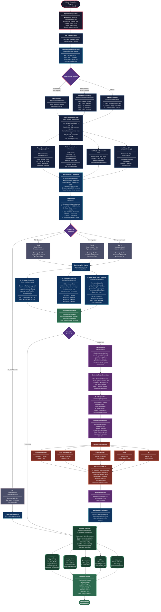

# Data Ingestion Pipeline Flow

```mermaid
flowchart TD
    %% ── Styling ──
    classDef input fill:#1a1a2e,stroke:#e94560,color:#fff,stroke-width:2px
    classDef api fill:#16213e,stroke:#0f3460,color:#fff,stroke-width:2px
    classDef process fill:#0f3460,stroke:#53a8b6,color:#fff,stroke-width:2px
    classDef decision fill:#533483,stroke:#e94560,color:#fff,stroke-width:2px
    classDef sim fill:#5b2c6f,stroke:#af7ac5,color:#fff,stroke-width:2px
    classDef db fill:#1b4332,stroke:#52b788,color:#fff,stroke-width:2px
    classDef output fill:#2d6a4f,stroke:#95d5b2,color:#fff,stroke-width:2px
    classDef noise fill:#7b2d26,stroke:#e07c5a,color:#fff,stroke-width:2px
    classDef tier fill:#4a4e69,stroke:#9a8c98,color:#fff,stroke-width:2px

    %% ═══════════════════════════════════════
    %% SECTION 1: INPUTS & CONFIGURATION
    %% ═══════════════════════════════════════

    START(["`**Dataset Generation Request**
    generateDataset()`"]):::input

    CONFIG["`**Pipeline Configuration**
    ─────────────────────
    • Satellite NORAD IDs (calibration set of 30)
    • Time range / sweep_time
    • Quality Tier (T1–T4)
    • Orbital regime hints
    • Search strategy override`"]:::input

    START --> CONFIG
    CONFIG --> AUTH

    %% ═══════════════════════════════════════
    %% SECTION 2: UDL AUTHENTICATION
    %% ═══════════════════════════════════════

    AUTH["`**UDL Authentication**
    ─────────────────────
    POST /auth → Bearer token
    Cached with TTL refresh`"]:::api

    AUTH --> REGIME

    %% ═══════════════════════════════════════
    %% SECTION 3: ORBITAL REGIME DETECTION
    %% ═══════════════════════════════════════

    REGIME["`**Orbital Regime Classification**
    determine_orbital_regime()
    ─────────────────────
    HEO: eccentricity ≥ 0.7
    LEO: SMA < 8,378 km
    GEO: SMA ≥ 42,164 km
    MEO: everything else`"]:::process

    REGIME --> STRATEGY

    %% ═══════════════════════════════════════
    %% SECTION 4: SEARCH STRATEGY SELECTION
    %% ═══════════════════════════════════════

    STRATEGY{"`**Select Search Strategy**`"}:::decision

    STRATEGY -->|"Small window /\nfew satellites"| FAST
    STRATEGY -->|"Large window /\nmany satellites"| WINDOWED
    STRATEGY -->|"Default"| HYBRID

    %% ── Fast Strategy ──
    FAST["`**FAST Strategy**
    _fetch_observations_fast()
    ─────────────────────
    Single query per satellite
    over full time range`"]:::api

    %% ── Windowed Strategy ──
    WINDOWED["`**WINDOWED Strategy**
    _fetch_observations_windowed()
    ─────────────────────
    Splits time into chunks:
    LEO → 6 hr windows
    MEO → 12 hr windows
    GEO → 24 hr windows
    HEO → 8 hr windows`"]:::api

    %% ── Hybrid Strategy ──
    HYBRID["`**HYBRID Strategy**
    (count-first optimization)
    ─────────────────────
    1. Query expected record count
    2. If count > 10,000 → chunked
    3. If count ≤ 10,000 → direct`"]:::api

    FAST --> QUERY_OPT
    WINDOWED --> QUERY_OPT
    HYBRID --> QUERY_OPT

    %% ═══════════════════════════════════════
    %% SECTION 5: API QUERY LAYER
    %% ═══════════════════════════════════════

    QUERY_OPT["`**Query Optimization Layer**
    smart_query() / UDLQuery()
    ─────────────────────
    • LRU cache (1000 entries, 15-min TTL)
    • Rate limiting (0.1s between requests)
    • Semaphore concurrency (max 10)
    • Retry 3× with exponential backoff
    • 120s timeout per query`"]:::api

    QUERY_OPT --> FETCH_OBS & FETCH_SV & FETCH_TLE & FETCH_DISCO

    %% ── Parallel Data Fetches ──
    FETCH_OBS["`**Fetch Observations**
    /eoobservation
    ─────────────────────
    Filters: uct=false,
    dataMode=REAL
    ─────────────────────
    Fields: obTime, satNo,
    RA, Dec, Az, El, range,
    sensor pos, trackId,
    magnitude, idSensor`"]:::api

    FETCH_SV["`**Fetch State Vectors**
    /statevector
    ─────────────────────
    Fields: epoch,
    position (x,y,z),
    velocity (vx,vy,vz),
    covariance matrix,
    dragCoeff, SRP coeff
    ─────────────────────
    Prioritizes vectors
    with covariance data`"]:::api

    FETCH_TLE["`**Fetch TLEs / Element Sets**
    /elset
    ─────────────────────
    Fields: epoch, line1, line2
    Parsed → SMA, ecc, inc,
    RAAN, argPerigee,
    meanAnomaly, meanMotion`"]:::api

    FETCH_DISCO["`**Fetch Mass & Area**
    ESA Discosweb API
    ─────────────────────
    Fields: mass (kg),
    xSectAvg (m²)
    ─────────────────────
    Used for HAMR object
    identification
    (optional – skipped if
    no ESA token)`"]:::api

    FETCH_OBS --> DEDUP
    FETCH_SV --> DEDUP
    FETCH_TLE --> DEDUP
    FETCH_DISCO --> DEDUP

    %% ═══════════════════════════════════════
    %% SECTION 6: DEDUPLICATION & VALIDATION
    %% ═══════════════════════════════════════

    DEDUP["`**Deduplication & Validation**
    ─────────────────────
    • Deduplicate state vectors
      (keep ones with covariance)
    • Filter satellites missing TLE data
    • Validate RA/Dec ranges
    • Enforce required field presence
    • Natural key: sat + time + sensor`"]:::process

    DEDUP --> BINNING

    %% ═══════════════════════════════════════
    %% SECTION 7: TRACK BINNING
    %% ═══════════════════════════════════════

    BINNING["`**Track Binning**
    binTracks()
    ─────────────────────
    1. Compute orbital period per sat
       T = 2π√(a³/μ), μ = 398600 km³/s²
    2. Group obs by sensor + satellite
    3. Gap threshold: 90 minutes
       < 90 min → same track
       > 90 min → new track
    4. Discard tracks with < 3 obs`"]:::process

    BINNING --> TIER_CHECK

    %% ═══════════════════════════════════════
    %% SECTION 8: TIER-BASED ROUTING
    %% ═══════════════════════════════════════

    TIER_CHECK{"`**Quality Tier
    Selection**`"}:::decision

    TIER_CHECK -->|"T1 – High Fidelity"| T1
    TIER_CHECK -->|"T2 – Standard"| T2
    TIER_CHECK -->|"T3 – Degraded"| T3
    TIER_CHECK -->|"T4 – Lowest Quality"| T4

    T1["`**Tier 1**
    Real data only
    Minimal reduction
    ─────────────────────
    Coverage: 20–40%
    Gap target: 1.5 periods
    Max obs/sat: 200`"]:::tier
    T2["`**Tier 2**
    Real + filtered
    Moderate reduction
    ─────────────────────
    Coverage: 5–15%
    Gap target: 2.0 periods
    Max obs/sat: 50`"]:::tier
    T3["`**Tier 3**
    Real + sparse + sim
    Aggressive reduction
    ─────────────────────
    Coverage: 2–10%
    Gap target: 3.0 periods
    Max obs/sat: 30`"]:::tier
    T4["`**Tier 4**
    Mostly simulated
    Extreme reduction
    ─────────────────────
    Coverage: 1–5%
    Gap target: 4.0 periods
    Max obs/sat: 20`"]:::tier

    T1 --> DS_SKIP
    T2 --> DOWNSAMPLE
    T3 --> DOWNSAMPLE
    T4 --> DOWNSAMPLE

    DS_SKIP["`**Skip Downsampling**
    (T1 – minimal processing)`"]:::process
    DS_SKIP --> DB_INGEST

    %% ═══════════════════════════════════════
    %% SECTION 9: DOWNSAMPLING
    %% ═══════════════════════════════════════

    DOWNSAMPLE["`**Downsampling Engine**
    apply_downsampling()
    downsampleData()`"]:::process

    DOWNSAMPLE --> DS1 & DS2 & DS3

    DS1["`**1. Coverage Reduction**
    _lowerOrbitCoverage()
    ─────────────────────
    • Convex hull polygon approach
    • Greedy removal of points
      with least coverage impact
    • Targets regime-specific
      coverage range
    ─────────────────────
    LEO: 2–15%  MEO: 3–20%
    GEO: 5–30%  HEO: 1–10%`"]:::process

    DS2["`**2. Track Gap Widening**
    _increaseTrackDistance()
    ─────────────────────
    • Sliding window finds
      minimum observation windows
    • Removes obs from min window
      to enforce target gap
    • Preserves track boundaries
    ─────────────────────
    LEO: 1.5–5.0 periods
    MEO: 1.0–3.0 periods
    GEO: 0.5–2.0 periods
    HEO: 2.0–8.0 periods`"]:::process

    DS3["`**3. Observation Count Capping**
    _downsampleAbsolute()
    ─────────────────────
    • Time-binned sampling
      (10 bins, uniform dist)
    • Density-weighted selection
      (inverse time-gap weights)
    • Always preserves first/last
      obs of each track
    ─────────────────────
    LEO: 3–10 obs/track
    MEO: 5–15 obs/track
    GEO: 10–30 obs/track
    HEO: 3–8 obs/track`"]:::process

    DS1 --> DS_META
    DS2 --> DS_META
    DS3 --> DS_META

    DS_META["`**Downsampling Metrics**
    ─────────────────────
    • Retention ratio (% kept)
    • Coverage achieved vs target
    • Gap coverage achieved
    • Obs count coverage achieved`"]:::output

    DS_META --> SIM_CHECK

    %% ═══════════════════════════════════════
    %% SECTION 10: SIMULATION DECISION
    %% ═══════════════════════════════════════

    SIM_CHECK{"`**Simulation
    Required?**`"}:::decision

    SIM_CHECK -->|"T1 / T2 – No"| DB_INGEST
    SIM_CHECK -->|"T3 / T4 – Yes"| SIM_GAP

    %% ═══════════════════════════════════════
    %% SECTION 11: SIMULATION PIPELINE
    %% ═══════════════════════════════════════

    SIM_GAP["`**Gap Detection**
    epochsToSim()
    ─────────────────────
    • Divides obs window into
      bins (10 per orbital period)
    • Identifies empty bins
      (bins with < 1 obs)
    • Prioritizes emptiest bins
    • Creates synthetic epochs
      at bin centers`"]:::sim

    SIM_GAP --> SIM_TRACKS

    SIM_TRACKS["`**Synthetic Track Generation**
    ─────────────────────
    • 3–5 obs per synthetic track
    • 30 sec spacing between obs
    • Synthetic obs capped at
      50% of total dataset
    • Min 3 real obs required
      before simulation runs`"]:::sim

    SIM_TRACKS --> SIM_PROP

    SIM_PROP["`**TLE Propagation**
    TLEpropagator() / SGP4
    ─────────────────────
    Propagate TLE to each
    synthetic epoch →
    position & velocity
    in TEME frame →
    convert to topocentric
    RA/Dec for each sensor`"]:::sim

    SIM_PROP --> SIM_VIS

    SIM_VIS["`**Visibility & Illumination**
    ─────────────────────
    • Find visible sensors
      (elevation > 6°)
    • Shadow detection
      (cylindrical Earth model)
    • Solar phase angle calc
    • Atmospheric refraction
      correction`"]:::sim

    SIM_VIS --> NOISE

    %% ═══════════════════════════════════════
    %% SECTION 12: NOISE INJECTION
    %% ═══════════════════════════════════════

    NOISE["`**Sensor Noise Injection**`"]:::noise

    NOISE --> N1 & N2 & N3 & N4 & N5

    N1["`**GEODSS (Optical)**
    ─────────────────
    Angular: 0.5 arcsec
    Timing: 1 ms`"]:::noise
    N2["`**SBSS (Space-Based)**
    ─────────────────
    Angular: 0.3 arcsec
    Timing: 0.5 ms`"]:::noise
    N3["`**Commercial EO**
    ─────────────────
    Angular: 1.0 arcsec
    Timing: 5 ms`"]:::noise
    N4["`**Radar**
    ─────────────────
    Range: 10 m
    Range rate: 0.01 m/s`"]:::noise
    N5["`**RF**
    ─────────────────
    Angular: 0.1°
    Timing: 10 ms`"]:::noise

    N1 --> PHOT
    N2 --> PHOT
    N3 --> PHOT
    N4 --> PHOT
    N5 --> PHOT

    PHOT["`**Photometric Effects**
    ─────────────────────
    • Lambertian reflection model
    • Albedo effects (default 0.2)
    • Range² brightness falloff
    • Atmospheric extinction
      (airmass correction)
    • Velocity aberration
      (observer + satellite motion)`"]:::noise

    PHOT --> SIM_TAG

    SIM_TAG["`**Tag Simulated Data**
    ─────────────────────
    dataMode = 'SIMULATED'
    is_simulated = True
    + noise metadata`"]:::sim

    SIM_TAG --> MERGE

    MERGE["`**Merge Real + Simulated**
    ─────────────────────
    Combine downsampled real
    observations with synthetic
    observations into unified
    dataset`"]:::process

    MERGE --> DB_INGEST

    %% ═══════════════════════════════════════
    %% SECTION 13: DATABASE PERSISTENCE
    %% ═══════════════════════════════════════

    DB_INGEST["`**Database Ingestion**
    DataIngestionPipeline
    → Supabase / PostgreSQL
    ─────────────────────
    • Batch insert (10,000 rows/txn)
    • Column name normalization
      (UDL → standard schema)
    • Natural key dedup
      (satellite + time + sensor)
    • Data source tagging
    • Creation timestamp`"]:::db

    DB_INGEST --> DB_OBS & DB_SV & DB_TLE & DB_SAT & DB_DS

    DB_OBS[("` **observations**
    id, obTime, satNo,
    RA, Dec, Az, El,
    range, idSensor,
    trackId, magnitude,
    dataMode, is_simulated`")]:::db

    DB_SV[("` **state_vectors**
    satNo, epoch,
    x/y/z pos & vel,
    covariance matrix,
    dragCoeff, SRP coeff`")]:::db

    DB_TLE[("` **element_sets**
    satNo, epoch,
    TLE line1, line2`")]:::db

    DB_SAT[("` **satellites**
    satNo, name,
    object_type, mass,
    cross_section_m²`")]:::db

    DB_DS[("` **datasets**
    dataset metadata,
    tier, config,
    generation timestamp`")]:::db

    %% ═══════════════════════════════════════
    %% SECTION 14: OUTPUT REPORT
    %% ═══════════════════════════════════════

    DB_OBS --> REPORT
    DB_SV --> REPORT
    DB_TLE --> REPORT
    DB_SAT --> REPORT
    DB_DS --> REPORT

    REPORT["`**Ingestion Report**
    ─────────────────────
    • Total records inserted
    • Duplicates skipped
    • Failures logged
    • Satellites: success/fail
    • Success rate %
    • Validation error log
    • Retention ratio
    • Tier config summary`"]:::output

    REPORT --> DONE(["`**Dataset Ready
    for Evaluation**`"]):::output
```
