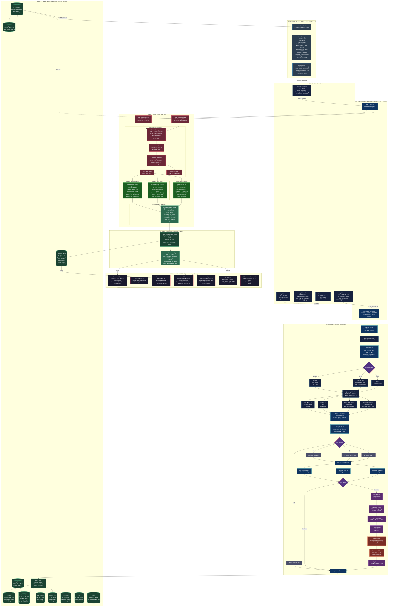

# UCT Benchmark DMR — Complete System Pipeline

```mermaid
flowchart TD
    classDef frontend fill:#1a1a2e,stroke:#e94560,color:#fff,stroke-width:2px
    classDef api fill:#16213e,stroke:#0f3460,color:#fff,stroke-width:2px
    classDef process fill:#0f3460,stroke:#53a8b6,color:#fff,stroke-width:2px
    classDef decision fill:#533483,stroke:#e94560,color:#fff,stroke-width:2px
    classDef sim fill:#5b2c6f,stroke:#af7ac5,color:#fff,stroke-width:2px
    classDef db fill:#1b4332,stroke:#52b788,color:#fff,stroke-width:2px
    classDef output fill:#2d6a4f,stroke:#95d5b2,color:#fff,stroke-width:2px
    classDef noise fill:#7b2d26,stroke:#e07c5a,color:#fff,stroke-width:2px
    classDef tier fill:#4a4e69,stroke:#9a8c98,color:#fff,stroke-width:2px
    classDef eval fill:#6b2737,stroke:#c9485b,color:#fff,stroke-width:2px
    classDef user fill:#2c3e50,stroke:#3498db,color:#fff,stroke-width:2px
    classDef metric fill:#1b5e20,stroke:#66bb6a,color:#fff,stroke-width:2px

    %% ═══════════════════════════════════════════
    %% FRONTEND LAYER
    %% ═══════════════════════════════════════════

    subgraph FRONTEND["PHASE 1: USER INTERFACE (React 18 + TypeScript)"]
        DASH["Dashboard Page<br/>Stats, Top Rank, Recent Submissions,<br/>Leaderboard Snapshot, Quick Actions"]:::frontend
        BROWSE["Dataset Browser<br/>Filter by regime/tier/status,<br/>Preview, Download"]:::frontend
        GENERATOR["Dataset Generator<br/>5-Step Wizard:<br/>1.Regime 2.Quality 3.Objects<br/>4.Advanced 5.Review"]:::frontend
        SUBMIT["Submit Page<br/>Drag/Drop JSON upload<br/>5-step validation:<br/>Format→Schema→ObsIDs→<br/>StateVecs→Covariance"]:::frontend
        RESULTS_PG["Results Page<br/>F1/Precision/Recall cards,<br/>Binary/State/Residual tabs,<br/>Per-satellite breakdown,<br/>Export JSON/CSV"]:::frontend
        LEADER_PG["Leaderboard<br/>Rankings by F1 DESC,<br/>Performance Trends chart,<br/>Top 3 podium"]:::frontend
        CESIUM["Orbit Viewer (Cesium 3D)<br/>Satellite positions, ground tracks,<br/>animated playback 1x-1000x"]:::frontend
    end

    %% ═══════════════════════════════════════════
    %% API LAYER
    %% ═══════════════════════════════════════════

    subgraph API_LAYER["PHASE 2: FASTAPI BACKEND"]
        DS_API["/api/v1/datasets<br/>GET/ POST/ DELETE/<br/>GET /{id}/observations<br/>GET /{id}/download<br/>POST /{id}/link-observations"]:::api
        SUB_API["/api/v1/submissions<br/>GET/ POST/<br/>POST /{id}/results<br/>Status: queued→validating<br/>→processing→completed"]:::api
        RES_API["/api/v1/results<br/>GET /{sub_id}<br/>GET /{sub_id}/metrics<br/>GET /{sub_id}/visualization<br/>GET /{sub_id}/export"]:::api
        LB_API["/api/v1/leaderboard<br/>GET / (ranked by F1)<br/>GET /history<br/>GET /statistics"]:::api
        JOB_API["/api/v1/jobs<br/>GET /{job_id}<br/>Progress: 0-100%<br/>Stage descriptions"]:::api
    end

    FRONTEND --> API_LAYER

    %% ═══════════════════════════════════════════
    %% JOB ORCHESTRATION
    %% ═══════════════════════════════════════════

    subgraph JOBS["PHASE 3: JOB ORCHESTRATION (ThreadPoolExecutor, 4 workers)"]
        JOB_DS["Job: dataset_generation<br/>pending→running→completed<br/>Stage-aware progress callback"]:::process
        JOB_EVAL["Job: evaluation<br/>Load uploaded JSON<br/>Compare to truth data"]:::process
    end

    DS_API -->|"POST / → job_id"| JOB_DS
    SUB_API -->|"POST / → job_id"| JOB_EVAL
    JOB_API -.->|"poll status"| JOBS

    %% ═══════════════════════════════════════════
    %% DATA INGESTION PIPELINE
    %% ═══════════════════════════════════════════

    subgraph INGEST["PHASE 4: DATA INGESTION PIPELINE"]
        direction TB
        CONFIG["Pipeline Config<br/>NORAD IDs, time range,<br/>tier T1-T4, regime"]:::process
        UDL_AUTH["UDL Authentication<br/>POST /auth → Bearer token"]:::api
        REGIME["Orbital Regime Classification<br/>HEO: ecc≥0.7 | LEO: SMA&lt;8378km<br/>GEO: SMA≥42164km | MEO: else"]:::process
        STRAT{"Search Strategy"}:::decision
        FAST["FAST<br/>Single query/sat"]:::api
        WINDOWED["WINDOWED<br/>LEO 6hr, MEO 12hr,<br/>GEO 24hr, HEO 8hr"]:::api
        HYBRID["HYBRID<br/>>10K→chunk<br/>≤10K→direct"]:::api
        QUERY_OPT["Query Optimization<br/>LRU cache, rate limit,<br/>semaphore(10), retry 3×"]:::api
        FETCH_OBS["Fetch Observations<br/>/eoobservation<br/>uct=false, mode=REAL"]:::api
        FETCH_SV["Fetch State Vectors<br/>/statevector<br/>pos, vel, covariance"]:::api
        FETCH_TLE["Fetch TLEs<br/>/elset<br/>line1, line2"]:::api
        FETCH_ESA["Fetch Mass/Area<br/>ESA Discosweb<br/>(optional)"]:::api
        DEDUP["Dedup & Validation<br/>Covariance priority,<br/>RA/Dec ranges, required fields"]:::process
        BINNING["Track Binning — binTracks()<br/>T=2π√(a³/μ), 90-min gap,<br/>discard tracks &lt;3 obs"]:::process
        TIER{"Tier Selection"}:::decision
        T1["T1: Real only, 20-40%"]:::tier
        T2["T2: Filtered, 5-15%"]:::tier
        T3["T3: Sparse+sim, 2-10%"]:::tier
        T4["T4: Mostly sim, 1-5%"]:::tier
        DS_ENGINE["Downsampling Engine"]:::process
        DS_COV["Coverage Reduction<br/>Convex hull greedy"]:::process
        DS_GAP["Track Gap Widening<br/>Sliding window"]:::process
        DS_CAP["Obs Count Capping<br/>Time-bin sampling"]:::process
        SIM_CHK{"Simulation?"}:::decision
        GAP_DET["Gap Detection<br/>epochsToSim()<br/>10 bins/period"]:::sim
        SYN_TRK["Synthetic Tracks<br/>3-5 obs, 30s spacing,<br/>max 50% synthetic"]:::sim
        SGP4["TLE Propagation<br/>SGP4 → TEME → RA/Dec"]:::sim
        VIS["Visibility Check<br/>elev>6°, shadow,<br/>refraction"]:::sim
        NOISE_INJ["Sensor Noise<br/>GEODSS 0.5″ | SBSS 0.3″<br/>CommEO 1.0″ | Radar 10m<br/>RF 0.1°"]:::noise
        PHOT["Photometric Effects<br/>Lambertian, albedo,<br/>range², extinction"]:::noise
        TAG_SIM["Tag Simulated<br/>dataMode=SIMULATED"]:::sim
        MERGE["Merge Real + Simulated"]:::process

        CONFIG --> UDL_AUTH --> REGIME --> STRAT
        STRAT -->|"small"| FAST
        STRAT -->|"large"| WINDOWED
        STRAT -->|"default"| HYBRID
        FAST --> QUERY_OPT
        WINDOWED --> QUERY_OPT
        HYBRID --> QUERY_OPT
        QUERY_OPT --> FETCH_OBS & FETCH_SV & FETCH_TLE & FETCH_ESA
        FETCH_OBS --> DEDUP
        FETCH_SV --> DEDUP
        FETCH_TLE --> DEDUP
        FETCH_ESA --> DEDUP
        DEDUP --> BINNING --> TIER
        TIER -->|T1| T1
        TIER -->|T2| T2
        TIER -->|T3| T3
        TIER -->|T4| T4
        T2 --> DS_ENGINE
        T3 --> DS_ENGINE
        T4 --> DS_ENGINE
        DS_ENGINE --> DS_COV & DS_GAP & DS_CAP
        DS_COV --> SIM_CHK
        DS_GAP --> SIM_CHK
        DS_CAP --> SIM_CHK
        SIM_CHK -->|"T3/T4 Yes"| GAP_DET
        GAP_DET --> SYN_TRK --> SGP4 --> VIS --> NOISE_INJ --> PHOT --> TAG_SIM --> MERGE
        SIM_CHK -->|"T1/T2 No"| MERGE
        T1 --> MERGE
    end

    JOB_DS --> CONFIG

    %% ═══════════════════════════════════════════
    %% DATABASE
    %% ═══════════════════════════════════════════

    subgraph DATABASE["PHASE 5: DATABASE (Supabase / PostgreSQL / DuckDB)"]
        DB_INGEST["Batch Insert<br/>10,000 rows/txn<br/>Column normalization<br/>Natural key dedup"]:::db
        DB_SAT[("satellites<br/>sat_no, name, type,<br/>mass, cross_section,<br/>orbital_regime")]:::db
        DB_OBS[("observations<br/>id, sat_no, ob_time,<br/>ra, dec, range,<br/>sensor, track_id,<br/>is_uct, is_simulated")]:::db
        DB_SV[("state_vectors<br/>sat_no, epoch,<br/>pos/vel xyz,<br/>covariance 6×6")]:::db
        DB_TLE[("element_sets<br/>sat_no, epoch,<br/>line1/2, SMA,<br/>ecc, inc, period")]:::db
        DB_DS[("datasets<br/>id, name, tier,<br/>regime, time_window,<br/>obs/sat count,<br/>ds/sim config")]:::db
        DB_DSOBS[("dataset_observations<br/>dataset_id ↔ obs_id<br/>track_id, object_id")]:::db
        DB_DSREF[("dataset_references<br/>dataset_id, sat_no,<br/>state_vec_id, elset_id")]:::db
        DB_SUB[("submissions<br/>id, dataset_id,<br/>algorithm, version,<br/>status, file_path")]:::db
        DB_RES[("submission_results<br/>TP, FP, FN, F1,<br/>precision, recall,<br/>pos/vel RMS,<br/>mahalanobis,<br/>ra/dec RMS,<br/>raw_results JSON")]:::db
        DB_JOBS[("jobs<br/>id, type, status,<br/>progress 0-100,<br/>result, error")]:::db
        DB_EVT[("events<br/>type, time range,<br/>primary/secondary sat,<br/>confidence")]:::db
    end

    MERGE --> DB_INGEST
    DB_INGEST --> DB_SAT & DB_OBS & DB_SV & DB_TLE
    DB_DS --> DB_DSOBS
    DB_DSOBS --> DB_OBS
    DB_DS --> DB_DSREF

    %% ═══════════════════════════════════════════
    %% EXTERNAL USER ALGORITHM
    %% ═══════════════════════════════════════════

    subgraph EXTERNAL["PHASE 6: EXTERNAL — USER'S UCTP ALGORITHM"]
        DOWNLOAD["User Downloads<br/>Benchmark Dataset (JSON)"]:::user
        UCTP["User's UCTP Algorithm<br/>1. Receive raw observations<br/>2. Identify tracks<br/>3. Observation triplets<br/>4. Gauss IOD → state vectors<br/>5. Outlier culling (SMA bounds)<br/>6. Orbit refinement<br/>7. Track-to-orbit association<br/>8. TLE generation<br/>9. Covariance estimation"]:::user
        UCTP_OUT["Output JSON:<br/>• Determined orbits (states)<br/>• Track-to-orbit associations<br/>• Covariance matrices 6×6<br/>• TLE element sets<br/>• Confidence scores"]:::user
        DOWNLOAD --> UCTP --> UCTP_OUT
    end

    DB_DS -->|"GET /download"| DOWNLOAD
    UCTP_OUT -->|"POST /submissions"| SUB_API

    %% ═══════════════════════════════════════════
    %% EVALUATION PIPELINE
    %% ═══════════════════════════════════════════

    subgraph EVALUATION["PHASE 7: EVALUATION PIPELINE"]
        direction TB
        LOAD_REF["Load Reference Data<br/>Truth states, TLEs,<br/>observations from dataset"]:::eval
        LOAD_SUB["Load Submission File<br/>Candidate orbits,<br/>associations, covariance"]:::eval

        subgraph STAGE1["Stage 1: Orbit Association"]
            PROP_TRUTH["Parallel Propagation<br/>Truth → candidate epochs<br/>Orekit RK853 integrator<br/>(120×120 gravity, Sun/Moon,<br/>drag, SRP)"]:::eval
            COST_MTX["Cost Matrix<br/>cost[i,j] = ||residuals||<br/>Euclidean norm"]:::eval
            HUNGARIAN["Hungarian Algorithm<br/>scipy linear_sum_assignment<br/>Global min-cost 1:1 matching"]:::eval
            ASSOC["Associated Orbits<br/>(uct=False, +error)"]:::eval
            NON_ASSOC["Non-Associated<br/>(True UCTs, uct=True)"]:::eval
        end

        subgraph STAGE2["Stage 2: Binary Metrics"]
            BINARY["Merge on obs ID<br/>TP = correct assoc.<br/>FP = wrong assoc.<br/>FN = missed assoc.<br/>Precision = TP/(TP+FP)<br/>Recall = TP/(TP+FN)<br/>F1 = 2PR/(P+R)<br/>Cohen's κ, MCC"]:::metric
        end

        subgraph STAGE3["Stage 3: State Metrics"]
            STATE["Propagate truth → cand epoch<br/>Δpos (km), Δvel (km/s)<br/>Position RMS, Velocity RMS<br/>Mahalanobis = √(δᵀC⁻¹δ)<br/>NEES, Chi² p-scores<br/>Per-component bias"]:::metric
        end

        subgraph STAGE4["Stage 4: Residual Metrics"]
            RESID["Propagate orbit → obs epochs<br/>Convert to RA/Dec<br/>Great-circle residuals<br/>RA RMSE, Dec RMSE (arcsec)<br/>Mean ± StdDev per orbit<br/>Element set diffs (if TLE)"]:::metric
        end

        subgraph STAGE5["Stage 5: Report Generation"]
            REPORT["Evaluation Report JSON:<br/>├ association_results<br/>├ binary_results<br/>├ state_results<br/>├ residual_ref_results<br/>├ residual_cand_results<br/>├ per_satellite_breakdown<br/>├ per_track_analysis<br/>└ temporal_breakdown"]:::output
        end

        LOAD_REF --> PROP_TRUTH
        LOAD_SUB --> PROP_TRUTH
        PROP_TRUTH --> COST_MTX --> HUNGARIAN
        HUNGARIAN --> ASSOC & NON_ASSOC
        ASSOC --> BINARY
        ASSOC --> STATE
        ASSOC --> RESID
        BINARY --> REPORT
        STATE --> REPORT
        RESID --> REPORT
    end

    JOB_EVAL --> LOAD_REF
    JOB_EVAL --> LOAD_SUB
    DB_DS -.->|"truth data"| LOAD_REF

    %% ═══════════════════════════════════════════
    %% RESULTS STORAGE & RANKING
    %% ═══════════════════════════════════════════

    subgraph RANKING["PHASE 8: RESULTS STORAGE & RANKING"]
        STORE_RES["Store in submission_results<br/>TP, FP, FN, F1, precision, recall,<br/>pos_rms, vel_rms, mahalanobis,<br/>ra/dec_rms, raw_results JSON"]:::db
        RANK_CALC["Leaderboard Ranking<br/>RANK() OVER (PARTITION BY dataset_id<br/>ORDER BY f1_score DESC)<br/>Filters: regime, tier, period<br/>Stats: avg/best/worst, trend"]:::output
    end

    REPORT --> STORE_RES --> DB_RES
    STORE_RES --> RANK_CALC

    %% ═══════════════════════════════════════════
    %% BACK TO FRONTEND
    %% ═══════════════════════════════════════════

    RANK_CALC -->|"via API"| LEADER_PG
    DB_RES -->|"via API"| RESULTS_PG
    RANK_CALC -->|"via API"| DASH
```
