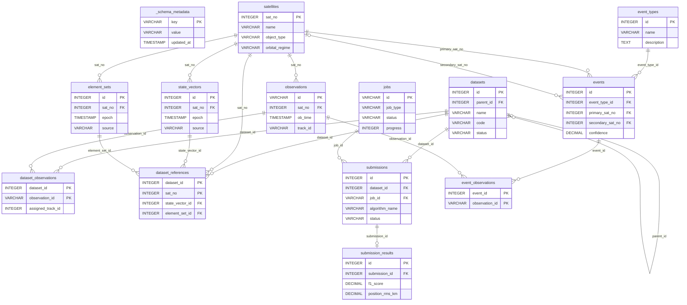

# Database Architecture

## UCT Benchmark - Data Storage Layer

**Version:** 1.0.0
**Updated:** January 2026

---

## 1. Overview

This document describes the database and data storage architecture implemented for the UCT Benchmark project. The system provides efficient storage, querying, and management of space surveillance data.

### 1.1 Design Goals

- **Zero Configuration**: No database server installation required
- **Backward Compatible**: Existing JSON/Parquet workflows unchanged
- **High Performance**: Sub-second queries for interactive use
- **Portable**: Cross-platform (Windows/Linux)
- **Version Control**: Dataset versioning and comparison

### 1.2 Technology Stack

| Component | Technology | Rationale |
|-----------|------------|-----------|
| Database | DuckDB v1.4.1+ | Already a dependency, analytical focus |
| Bulk Storage | Parquet | Columnar, compressed, DuckDB-native |
| Export Format | JSON | API compatibility, human-readable |
| ORM Layer | Custom Repository Pattern | Lightweight, no external dependencies |

---

## 2. Architecture Diagram

```
┌─────────────────────────────────────────────────────────────────┐
│                    APPLICATION LAYER                            │
│  (Python: Pandas, Polars, API Integration)                      │
└─────────────────────────────────────────────────────────────────┘
                              │
                              ▼
┌─────────────────────────────────────────────────────────────────┐
│                    DATA ACCESS LAYER                            │
│  DatabaseManager + Repository Pattern                           │
│                                                                 │
│  ┌──────────────┐ ┌──────────────┐ ┌──────────────┐            │
│  │ Satellite    │ │ Observation  │ │ StateVector  │            │
│  │ Repository   │ │ Repository   │ │ Repository   │            │
│  └──────────────┘ └──────────────┘ └──────────────┘            │
│  ┌──────────────┐ ┌──────────────┐ ┌──────────────┐            │
│  │ ElementSet   │ │ Dataset      │ │ Event        │            │
│  │ Repository   │ │ Repository   │ │ Repository   │            │
│  └──────────────┘ └──────────────┘ └──────────────┘            │
└─────────────────────────────────────────────────────────────────┘
                              │
          ┌───────────────────┼───────────────────┐
          ▼                   ▼                   ▼
┌─────────────────┐  ┌─────────────────┐  ┌─────────────────┐
│   DuckDB        │  │   Parquet       │  │   JSON          │
│   (Analytics)   │  │   (Bulk Data)   │  │   (Export)      │
│                 │  │                 │  │                 │
│ • Complex SQL   │  │ • Large scans   │  │ • API compat    │
│ • Aggregations  │  │ • Columnar ops  │  │ • Human-readable│
│ • Joins         │  │ • Archival      │  │ • Portability   │
└─────────────────┘  └─────────────────┘  └─────────────────┘
```

---

## 3. Database Schema

### 3.1 Entity Relationship Diagram

> **Reading the diagram:** `||` = exactly one, `o|` = zero or one, `o{` = zero or more. Only PK, FK, and signature columns shown — see table specifications in section 3.2 for full details.



### 3.2 Table Specifications

#### satellites
| Column | Type | Description |
|--------|------|-------------|
| sat_no | INTEGER PK | NORAD catalog number |
| name | VARCHAR(100) | Satellite name |
| cospar_id | VARCHAR(20) | COSPAR ID |
| object_type | VARCHAR(20) | PAYLOAD, ROCKET BODY, DEBRIS |
| orbital_regime | VARCHAR(10) | LEO, MEO, GEO, HEO |
| launch_date | DATE | Launch date |
| mass_kg | DECIMAL(10,2) | Mass in kg |
| cross_section_m2 | DECIMAL(10,4) | Cross-section area |

#### observations
| Column | Type | Description |
|--------|------|-------------|
| id | VARCHAR(64) PK | UDL observation ID |
| sat_no | INTEGER FK | Satellite reference |
| ob_time | TIMESTAMP | Observation time |
| ra | DECIMAL(12,8) | Right Ascension (degrees) |
| declination | DECIMAL(12,8) | Declination (degrees) |
| sensor_name | VARCHAR(100) | Sensor identifier |
| track_id | VARCHAR(64) | Track association |
| is_uct | BOOLEAN | UCT flag (decorrelated) |

#### state_vectors
| Column | Type | Description |
|--------|------|-------------|
| id | INTEGER PK | Auto-generated ID |
| sat_no | INTEGER FK | Satellite reference |
| epoch | TIMESTAMP | State epoch |
| x_pos, y_pos, z_pos | DECIMAL(16,6) | Position (km, J2000 ECI) |
| x_vel, y_vel, z_vel | DECIMAL(16,9) | Velocity (km/s, J2000 ECI) |
| covariance | JSON | 6x6 covariance matrix |
| source | VARCHAR(50) | UDL, SPACE_TRACK, PROPAGATED |

#### datasets
| Column | Type | Description |
|--------|------|-------------|
| id | INTEGER PK | Auto-generated ID |
| name | VARCHAR(100) UNIQUE | Dataset name |
| code | VARCHAR(20) | Dataset code (e.g., LEO_A_H_H_H) |
| version | INTEGER | Version number |
| parent_id | INTEGER | Parent dataset for versioning |
| tier | VARCHAR(5) | T1-T5 |
| orbital_regime | VARCHAR(10) | LEO, MEO, GEO, HEO |
| generation_params | JSON | Generation parameters |
| status | VARCHAR(20) | created, processing, complete, failed |

---

## 4. Repository Pattern

### 4.1 Class Hierarchy

```python
BaseRepository (ABC)
├── SatelliteRepository
├── ObservationRepository
├── StateVectorRepository
├── ElementSetRepository
├── DatasetRepository
└── EventRepository
```

### 4.2 Key Methods

#### DatasetRepository
```python
create_dataset(name, code, tier, ...) -> int
get_dataset(dataset_id=None, name=None) -> pd.Series
list_datasets(tier=None, regime=None) -> pd.DataFrame
update_dataset(dataset_id, **kwargs) -> bool
delete_dataset(dataset_id, cascade=True) -> bool
create_version(parent_id, changes=None) -> int
get_dataset_versions(dataset_id) -> pd.DataFrame
compare_datasets(id1, id2) -> dict
add_observations_to_dataset(dataset_id, obs_ids) -> int
```

#### ObservationRepository
```python
get_by_satellite_time_window(sat_no, start, end) -> pd.DataFrame
get_by_regime(regime, start, end) -> pd.DataFrame
bulk_insert(df) -> int
get_statistics(start=None, end=None) -> pd.DataFrame
get_track_gaps(sat_no, limit=10) -> pd.DataFrame
```

---

## 5. Query Performance

### 5.1 Indexes

| Index | Columns | Purpose |
|-------|---------|---------|
| idx_obs_time | observations(ob_time) | Time range queries |
| idx_obs_sat_time | observations(sat_no, ob_time) | Satellite + time queries |
| idx_obs_track | observations(track_id) | Track lookups |
| idx_sv_sat_epoch | state_vectors(sat_no, epoch) | State vector queries |
| idx_elset_sat_epoch | element_sets(sat_no, epoch) | TLE queries |

### 5.2 Performance Targets

| Query Type | Target Latency | Data Size |
|------------|---------------|-----------|
| Single satellite lookup | <50ms | Any |
| Time window query (1 week) | <200ms | <100K obs |
| Full regime aggregation | <1s | <1M obs |
| Dataset export | <5s | <50K obs |

---

## 6. Data Ingestion

### 6.1 Pipeline Flow

```
External API (UDL/Space-Track)
         │
         ▼
┌─────────────────┐
│ DataIngestion   │
│ Pipeline        │
├─────────────────┤
│ • Fetch data    │
│ • Validate      │
│ • Normalize     │
│ • Deduplicate   │
└─────────────────┘
         │
         ▼
┌─────────────────┐
│ Repository      │
│ bulk_insert()   │
└─────────────────┘
         │
         ▼
    DuckDB Tables
```

### 6.2 Validation Rules

| Field | Rule |
|-------|------|
| ra | 0 <= value <= 360 |
| declination | -90 <= value <= 90 |
| ob_time | Valid timestamp |
| sat_no | Positive integer |

---

## 7. Export Formats

### 7.1 JSON Export (Legacy Compatible)

```json
{
  "metadata": {
    "name": "Dataset Name",
    "code": "LEO_A_H_H_H",
    "tier": "T1",
    "orbital_regime": "LEO",
    "observation_count": 1000
  },
  "observations": [
    {
      "id": "obs-001",
      "ob_time": "2025-01-01T12:00:00.000000Z",
      "ra": 100.0,
      "declination": 45.0,
      "track_id": 1,
      "uct": true
    }
  ],
  "references": [
    {
      "sat_no": 25544,
      "sat_name": "ISS",
      "state_vector": {...},
      "tle": {...}
    }
  ]
}
```

### 7.2 Parquet Export

- Compression: ZSTD (default)
- Row group size: 100,000 rows
- Partitioning: Optional by orbital_regime

---

## 8. CLI Reference

```bash
# Initialize database
python -m uct_benchmark.database init [--force]

# Show status
python -m uct_benchmark.database status

# Backup/Restore
python -m uct_benchmark.database backup [-o path]
python -m uct_benchmark.database restore <backup_file>

# Export
python -m uct_benchmark.database export --dataset-id ID [-o path]
python -m uct_benchmark.database export --observations -o path.parquet

# Import
python -m uct_benchmark.database import <file> [--name name]

# List datasets
python -m uct_benchmark.database list [--tier T1] [--regime LEO]

# Maintenance
python -m uct_benchmark.database verify
python -m uct_benchmark.database vacuum
```

---

## 9. Integration Guide

### 9.1 Adding Database Support to Existing Code

```python
# In Create_Dataset.py
from uct_benchmark.database import DatabaseManager

def main():
    # Initialize database (optional)
    db = DatabaseManager()
    db.initialize()

    # Existing dataset generation
    dataset, obs_truth, state_truth, elset_truth = generateDataset(...)

    # Persist to database
    if USE_DATABASE:
        dataset_id = db.datasets.create_dataset(name="my_dataset", ...)
        db.observations.bulk_insert(obs_truth)
        db.state_vectors.bulk_insert(state_truth)
        db.datasets.add_observations_to_dataset(dataset_id, obs_truth['id'].tolist())

    # Existing JSON export (unchanged)
    saveDataset(obs_truth, track_truth, state_truth, elset_truth, output_path)
```

---

## 10. Future Enhancements

### Phase 2: Core Storage Integration
- Add `use_database=True` flag to API functions
- Automatic persistence during dataset generation
- Migration tools for existing data

### Phase 3: Advanced Features
- Event detection hooks
- Query caching layer
- Automated daily backups
- Real-time sync capabilities

---

## Related Documentation

- [Architecture Overview](ARCHITECTURE.md)
- [Backend API](BACKEND_API.md)
- [Pipeline](PIPELINE.md)
